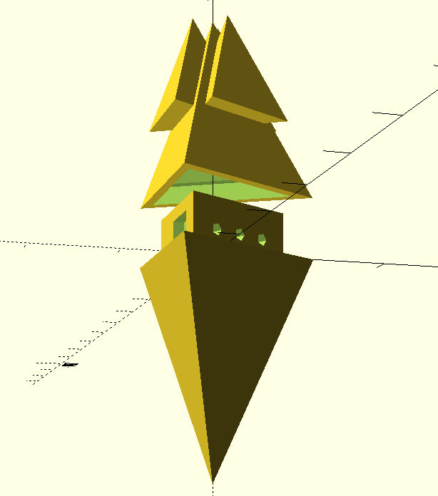

Gorg Super-Chip
=

Tip: "Why is it called a *super* chip?"
Oh: "It's mostly marketing."

I'm working on a 3-d model of the Gorg Super-Chip from the movie
"Home" so that I can print one for my kids. The plan is to make
the inside hollow and put in some green LEDs and leave holes in
the shell where there is green light in the movie.

I'm working from this image:

http://dreamworks.wikia.com/wiki/Gorg_Super-Chip

Current state:

